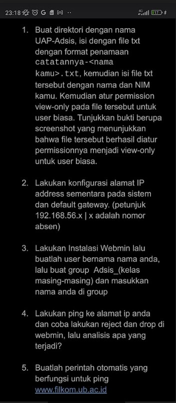

**Soal :**

Soal 1
------------------------------------------------

1) Membuat direktori baru dengan nama UAP-Adsis dengan menggunakan perintah
“mkdir”

2) Setelah itu, masuk ke dalam folder tersebut, dan buat file dengan nama catatanya-
ahmad.txt menggunakan perintah “touch”

3) Mengisikan file yang telah dibuat dengan nama dan nim

4) Lalu, memberikan permission view-only pada file yang telah dibuat menggunakan
perintah “chmod” menggunakan kode 644. Kode tersebut memiliki arti bahwa pemilik
akan memiliki akses untuk baca dan tulis, namun untuk user biasa hanya dapat
membacanya saja.

5) Menggunakan perintah “ls -l” untuk menampilkan hasil file yang telah diberikan
permission only.

Dapat dilihat bahwa file tersebut memiliki kode rw-r—r dimana kode tersebut
memiliki arti file hanya dapat baca dan diubah oleh pemiliki, dan user biasa hanya
dapat membaca saja

Soal 2
------------------------------------------------

1) Periksa antarmuka jaringan yang tersedia.

2) konfigurasi alamat IP dan default gateway sementara

3) memeriksa apakah konfigurasi alamat IP sementara dan default gateway berhasil dilakukan 

Soal 3
------------------------------------------------

1) Membuat user baru dengan cara masuk ke halaman user and groups. Pada halaman
ini, kita akan membuat user baru dengan cara menekan tombol “create new user” untuk
membuat user baru, dan memasukkan nama user

Dapat terlihat bahwa user “ahmads” sudah berhasil dibuat.

2) Selanjutnya, membuat grup baru dengan nama “gertran” dengan cara menekan tombol
“create a new group”. Pada saat membuat grup, lakukan penambahan user yang
sebelumnya telah dibuat

Soal 4
------------------------------------------------

1) Melakukan ping pada alamat IP 192.168.180.128

2) Membuat rule baru untuk melakukan reject kepada request paket bertipe ICMP

Soal 5
------------------------------------------------

1) Menjalankan perintah sudo crontab -e dan menuliskan perintah berikut untuk melakukan otomatisasi ping ke filkom.ub.ac.id

2) Setelah itu, dapat dilihat bahwa perintah ping telah terotomatisasi setiap 3 menit

